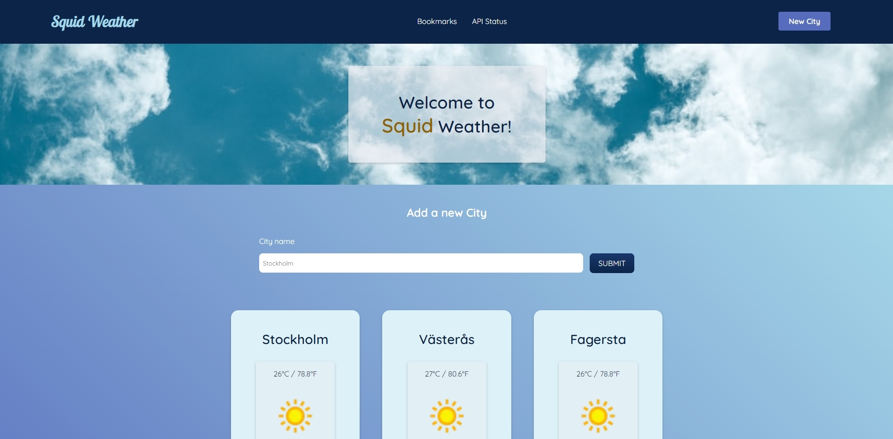

<h1 align="center"> Squid Weather API ☀️🌤️🌦️🌧️ </h1>

<h4 align = center> Team members</h4>

<p align = center>
  <a href="https://github.com/Sparven704">Arvid</a>
  &nbsp;&nbsp;&nbsp;&nbsp;|&nbsp;&nbsp;&nbsp;&nbsp;
  <a href="https://github.com/Cecilia-Coutinho">Cecilia</a>
  &nbsp;&nbsp;&nbsp;&nbsp;|&nbsp;&nbsp;&nbsp;&nbsp;
  <a href="https://github.com/akaMaxg">Max</a>
  &nbsp;&nbsp;&nbsp;&nbsp;|&nbsp;&nbsp;&nbsp;&nbsp;
  <a href="https://github.com/generalxo">Oliver</a>
  &nbsp;&nbsp;&nbsp;&nbsp;|&nbsp;&nbsp;&nbsp;&nbsp;
  <a href="https://github.com/lordstimpa">Steven</a>
  &nbsp;&nbsp;&nbsp;&nbsp;|&nbsp;&nbsp;&nbsp;&nbsp;
</p>

<p align = center>
-- Click on any name to access our individual GitHub profiles --
</p>
</br>

<h2>🌍 Project Overview</h2>

The development of this project was required by Chas Academy, and as such, it followed the specified requirements and deadline. This project is a web application that consists of a weather ASP.NET Minimal API and a React client. The main goals of the project were to plan and execute software tests with a focus on unit tests, applying test-driven development practices and utilizing advanced Git version control, including the implementation of a CI/CD pipeline. The team worked in an agile manner, following the Scrum methodology.

<h2>📋 Minimal Viable Product and Features:</h2>

The MVP of the project consists of a weather API and a React client without the usage of database. The weather API provides basic weather information to the client, such as current temperature, humidity, and weather conditions, while the React client interacts with the API to present the data in a user-friendly interface. The project also incorporates advanced Git version control practices, such as main branch protection and pull requests for collaboration. Additionally, a CI/CD pipeline is implemented using git post-receive for automated deployments.

- **Test-Driven Development**: To write tests before implementing the functionality to ensure reliability and accuracy of the weather API.
- **Minimal API**: To ensure a lightweight API with basic endpoints to retrieve weather data based on location input.
- **Weather API Integration**: Integration with weather data source to provide accurate and up-to-date information.
- **Current Weather Data for Stockholm**: To fetch the current weather data, including temperature, humidity, and wind, specifically for Stockholm.
- **Add Favorite City**: To save a favorite city, eliminating the need to enter it repeatedly (temporary storage during the application's runtime).
- **Current Weather for Favorite Cities**: To view essential weather information, such as location name, temperature, humidity, and conditions, for users saved favorite cities.
- **API Call Statistics**: to view the number of API calls made since the API was started.
- **React Client Interface**: To offer a user-friendly interface to interact with the weather API and retrieve the weather data.
- **Responsive Design**: To ensure optimal viewing and usability across different devices and screen sizes.
- **React Fetch API**: To enable communication between the React client and weather API for data retrieval and display.
- **CI/CD pipeline**: To implement a CI/CD pipeline with git post-receive for automated deployments.

<h2>💻 Technology Stack</h2>

👨‍💻 C#, JS, JSX, CSS

🚀 ASP.NET: Minimal API.

👨‍💻 React

    🚀 Vite

    📦 Node: v20.0.0

    📦 npm: v9.6.4

👥 GitHub: Version Control.

🖥️ Visual Studio and Visual Studio Code: IDEs

🦜 Swagger: API structure reader.

🛌 Insomnia: API test case management tool.

🐧 Linux Server: CI/CD pipeline

<h2>📏Project Methodology</h2>

The team adopted an agile methodology, specifically following the Scrum framework. This approach allowed for iterative and collaborative work throughout the project. Sprints were planned for a duration of one week, and task management was organized using Trello as the primary tool. Trello provided a visual representation of the workflow, with lists for the Product Backlog, Sprint Backlog, Sprint (for work in progress), Archived Tasks, and Important Information. By employing Scrum and Trello, the team ensured effective task management and facilitated communication within the team.

<a href="https://trello.com/b/PG5b4Q4E/team-squid">Trello Board</a>

Retrospectives were conducted after each sprint, and the team agreed to coordinate and communicate before pushing any code to prevent potential issues that could consume valuable time. Additionally, branch protection was enabled on the GitHub repository's main branch, requiring approval from other team members for pull requests before merging the code into the main branch.

<a href="https://onedrive.live.com/edit.aspx?resid=975F5EB59F3177CE!97580&ithint=file%2cdocx&authkey=!ABbsea742CJP6W8">Retrospectives</a>

Regular meetings were held, almost daily, and sprint planning sessions took place once a week to discuss the project's current status and define tasks for the upcoming sprint. Communication among team members was maintained through Discord and Slack.

<h2>💭Reflections and Aditional Info</h2>

**Test-driven development:**

Throughout the project, one notable aspect was the emphasis on test-driven development, which proved to be beneficial in ensuring the reliability and accuracy of the weather API. Writing tests before implementing the functionality helped identify and fix issues early on, leading to a more robust and stable system.

**CI/CD Pipeline:**

The implementation of a CI/CD pipeline was a significant milestone in the project. It brought several advantages and valuable lessons to the team. It's worth noting that it was not without its challenges, but it provided important insights and lessons for future projects. The pipeline's automation simplifies process for building, testing, and deploying the application and it proved to be highly beneficial since its minimizes the risk of human error during critical steps.

Furthermore, the CI/CD pipeline greatly enhances collaboration within the team, allowing multiple developers to work concurrently on different features and branches, ensuring smooth integration of changes. Pull requests and code reviews became integral components of the pipeline, promoting comprehensive code examination and knowledge sharing among team members. We believe that this collaborative aspect promotes a stronger sense of teamwork and facilitates the exchange of ideas and best practices.

As the team continues its journey, it recognizes the ongoing importance of CI/CD pipelines in future projects. It is a continuous learning process for the team members that requires keep learning new tools and techniques and staying updated. The experience gained from working with the CI/CD pipeline, particularly with the Linux server, provides a good foundation for improving development workflows, ensuring code quality, and delivering features efficiently to end-users.

**Code:**

The unit tests provided coverage of different scenarios, such as checking the expected status code and body content of a health check endpoint, retrieving weather data for specific locations, and verifying the accuracy of the location name. We used the HttpClient class in the code to send HTTP requests and retrieve the response content. Moreover, we also worked with asynchronous operations in the tests to handle various scenarios effectively.

_example of healthcheck:_

```
        // Test to check the body content of GET healthcheck
        [Fact]
        public async Task SquidApi_Healthcheck_ExpectedOk()
        {
            string expectedStatusCode = "OK";
            var client = new HttpClient();

            var response = await client.GetAsync("http://localhost:20500/healthcheck");
            string actual = await response.Content.ReadAsStringAsync();

            Assert.Equal(expectedStatusCode, actual);
        }
```

Working with Xunit has provided the opportunity to gain valuable experience in writing and executing unit tests, enhancing code quality, and ensuring the reliability and correctness of the application. The experience with Xunit has proven to be a good solution in promoting a test-driven development approach and building confidence in the codebase.

The API was built with three endpoints: /healthcheck, /weather, and /weather/\{city\}. The /healthcheck endpoint simply returns the string "OK" as the response. The /weather endpoint sends an HTTP GET request to an external weather API, retrieves the response content, and returns it as a JSON result. The city parameter in the /weather/\{city\} endpoint allows users to specify a specific city to retrieve weather data for. Similar to the /weather endpoint, it sends an HTTP GET request to the weather API, retrieves the response content, and returns it as a JSON result.

_endpoint /weather/\{city\}:_

```
app.MapGet("/weather/{city}", (string city) =>
{
    var client = new HttpClient();
    var apiKey = configuration["WeatherAPIKey"];

    if (string.IsNullOrEmpty(apiKey))
    {
        apiKey = "apikey";
    }

    var baseURL = "http://api.weatherapi.com/v1/current.json?key=";
    var response = client.GetAsync($"{baseURL}{apiKey}&q={city}").Result;
    var content = response.Content.ReadAsStringAsync().Result;

    return Results.Content(content, contentType: "application/json");
});
```

Regarding the Frontend, working with React Vite proved to be a nice experience for our team. The ease and efficiency of React, coupled with the streamlined configuration and setup provided by Vite, allowed us to quickly start developing our project without any unnecessary obstacles. The simplicity of the setup process saved us precious time and ensured that we could focus on writing code and building features.

Another significant advantage was its integration with React libraries. The ability to easily incorporate and work with various React libraries and tools proved to be a game-changer. The small component-based approach facilitated our development process, as it allowed us to distribute tasks among team members and work independently on different parts of the project.

_Navbar component:_

```
const Navbar = () => {

  const [click, setClick] = useState(false);

  const handleClick = () => setClick(!click);
  const closeMobileMenu = () => setClick(false);

  return (
    <>
      <Nav>
        <LogoH2 onClick={closeMobileMenu}>Squid Weather</LogoH2>
        <NavMenu className={click ? "nav-menu active" : "nav-menu"}>
          <MenuItem>
            <Link
              to="bookmarks"
              spy={true}
              smooth={true}
              offset={-70}
              duration={500}
              activeClass="active"
              onClick={closeMobileMenu}
            >
              Bookmarks
            </Link>
          </MenuItem>
          <MenuItem>
            <Link
              to="general-info"
              spy={true}
              smooth={true}
              offset={-70}
              duration={500}
              activeClass="active"
              onClick={closeMobileMenu}
            >
              General Info
            </Link>
          </MenuItem>
        </NavMenu>
        <NavBtn>
          <NavBtnLink
            to="add-city"
            spy={true}
            smooth={true}
            offset={-70}
            duration={500}
            activeClass="active"
          >
            New City
          </NavBtnLink>
        </NavBtn>
        {/* Mobile menu icon*/}
        <Bars onClick={handleClick}>
          {click ? <FaTimes /> : <FaBars />}
        </Bars>
      </Nav>
    </>
  );
};

export default Navbar;
```

Working with Styled Components had the benefit of its ability to enhance code readability and organization. By encapsulating the styles within the component itself, we could easily understand and manage the visual aspects of each component without having to navigate through separate stylesheets.

</img>

Additionally, the availability of resources, tutorials, and forums ensured that we could find answers to our questions and overcome challenges effectively. Overall, the team’s experience with React Vite was positive.

**Agile Methodology:**

Collaboration and communication played a crucial role in the success of the project. By adopting the Scrum framework and utilizing tools like Trello, Slack and Discord, the team effectively managed tasks, maintained transparency, and facilitated productive discussions. Regular meetings and constant communication channels allowed for quick problem-solving and ensured everyone was aligned with the project's goals.

**Additional Information:**

It is worth mentioning that the team recognizes that the project provided valuable insights into test-driven development, CI/CD Pipeline, agile development practices, and effective utilization of development tools. The team's commitment to continuous improvement, open communication, and planning contributed to the successful completion of the project.
